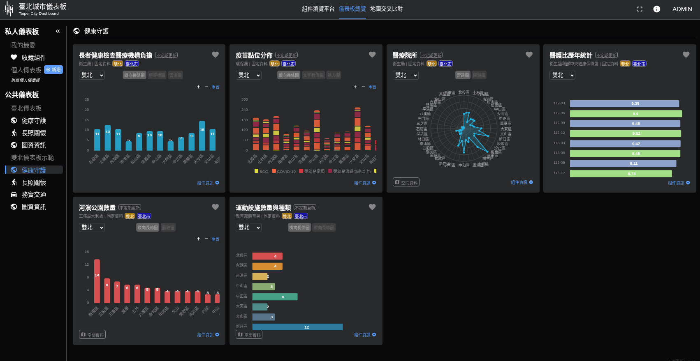
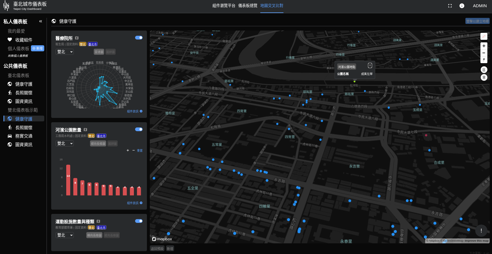
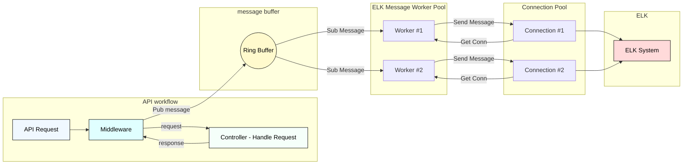

#  Taipei City Dashboard

## Introduction

Taipei City Dashboard is a data visualization platform developed by [Taipei Urban Intelligence Center (TUIC)](https://tuic.gov.taipei/en).

Our main goal is to create a comprehensive data visualization tool to assist in Taipei City policy decisions. This was achieved through the first version of the Taipei City Dashboard, which displayed a mix of internal and open data, seamlessly blending statistical and geographical data.

Fast forward to mid-2023, as Taipei City’s open data ecosystem matured and expanded, our vision gradually expanded as well. We aimed not only to aid policy decisions but also to keep citizens informed about the important statistics of their city. Given the effectiveness of this tool, we also hoped to publicize the codebase for this project so that any relevant organization could easily create a similar data visualization tool of their own.

Our dashboard, made yours.

Based on the above vision, we decided to begin development on Taipei City Dashboard 2.0. Unlike its predecessor, Taipei City Dashboard 2.0 will be a public platform instead of an internal tool. The codebase for Taipei City Dashboard will also be open-sourced, inviting all interested parties to participate in the development of this platform.

We have since released Taipei City Dashboard 2.0 to the general public. From now on, you will be able to suggest features and changes to Taipei City Dashboard and develop the platform alongside us. We are excited for you to join Taipei City Dashboard’s journey!

Please refer to the docs for the [Chinese Version](https://tuic.gov.taipei/documentation/front-end/introduction) (and click on the "switch languages" icon in the top right corner).

[Official Site](https://citydashboard.taipei) | [License](https://github.com/tpe-doit/Taipei-City-Dashboard/blob/main/LICENSE) | [Code of Conduct](https://github.com/tpe-doit/Taipei-City-Dashboard/blob/main/.github/CODE_OF_CONDUCT.md) | [Contribution Guide](https://tuic.gov.taipei/documentation/front-end/contribution-overview)

## Quick Start

Please refer to the [Docs](https://tuic.gov.taipei/documentation/front-end/project-setup) for the quick start guide.

## Documentation

Check out the complete documentation for Taipei City Dashboard [here](https://tuic.gov.taipei/documentation).
## bug-chef Team Contribution

A collaborative dashboard project that integrates various data sources from Taipei City, including real-time updates, geographic data, and a high-performance logging architecture. The project showcases teamwork and achievements from a hackathon.

The bug-chef team contributed the following:

1. **Health Guardian Dashboard Components**:

   * Medical institution load for senior health checkups
   * Vaccine site distribution
   * Medical facility locations
   * Yearly statistics of doctor-to-nurse ratio
   * Number of riverside parks
   * Quantity and types of sports facilities

2. **Asynchronous ELK API Logging Architecture**
   (Message Queue, Elasticsearch, Logstash, Kibana)

### Health Guardian Dashboard Components





### Asynchronous ELK Logging Architecture

1. When an API request is sent, middleware pushes the log message to a RingBuffer.
2. Multiple workers consume messages from the RingBuffer and process them asynchronously.
3. Workers use a connection pool to send messages to the backend ELK system.



### Usage

```bash
# Installation
## Initialize ELK
cd ./docker
## Start ELK containers
sudo docker compose -f docker-compose-elk.yaml up -d
# Follow the rest of the steps in the documentation
```

### Key Features

* **Asynchronous Logging**: Does not block the main execution flow; maintains API performance.
* **RingBuffer**: Processes log messages in FIFO order efficiently.
* **Worker Pool Design**: Supports dynamic scaling of concurrent workers.
* **Connection Pool**: Enables high-concurrency message delivery to the ELK stack.
## Contributors

Many thanks to the contributors to this project!

<a href="https://github.com/tpe-doit/Taipei-City-Dashboard/graphs/contributors">

</a>
